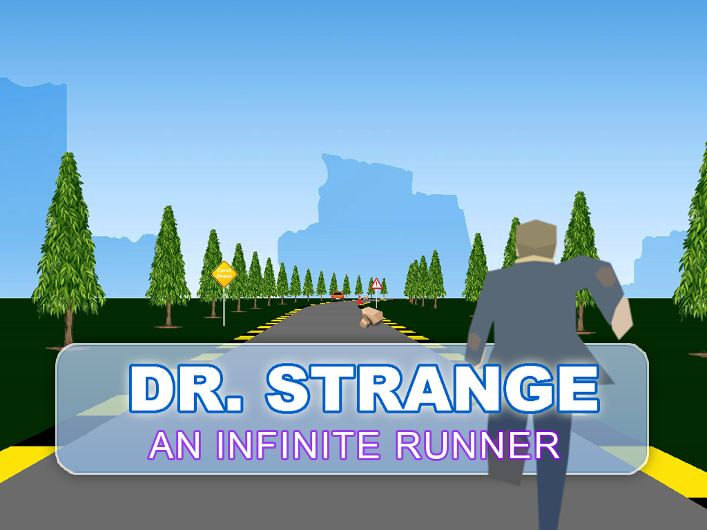

# Runner-3D-game

**Runner-3D-game** is a 3D infinite runner game developed in C++ using the SFML library. This project demonstrates advanced C++ programming techniques, including game loop management, event handling, graphics rendering, and real-time collision detection. The game challenges players to navigate through an endless environment, avoiding obstacles and collecting coins, all while enjoying smooth animations and immersive sound effects.



## Features and Key Functions

### 1. Main Game Loop and Window Management
- **`int main()`**: The core of the game, managing window creation, event handling, and the main game loop.
  - **Window Setup**: Uses `RenderWindow` to create and control the game window with a frame rate limit for smooth gameplay.
  - **Menu Management**: Calls the `LoadMenu` function to handle game startup, ensuring the player starts with a menu screen before gameplay.

### 2. Game Mechanics and Player Interaction
- **Player Control and Animation**:
  - **`Keyboard::isKeyPressed()`**: Detects player input for jumping (`Up` arrow) and lateral movement (`Left` and `Right` arrows).
  - **`player.setTextureRect()`**: Manages the player's sprite animation by changing texture rectangles based on the frame elapsed time.
- **Gravity and Jump Mechanics**:
  - **`player.move()` and `collider.move()`**: Implements gravity and jump physics, moving the player up when jumping and down when affected by gravity.

### 3. Obstacle and Coin Management
- **Dynamic Obstacle and Coin Generation**:
  - **`generateLines()`**: Generates the game’s road segments, providing the foundational path for the player.
  - **`generateObstacles()`**: Dynamically generates obstacles along the path, adding difficulty and variety to the game.
  - **`generateCoins()`**: Places coins on the path for the player to collect, offering an additional challenge and reward system.
- **Collision Detection**:
  - **`collider.getGlobalBounds()`**: Utilized to detect collisions between the player and obstacles or coins. Upon collision with an obstacle, the game stops, and a sound effect is triggered.
  - **`lines[startPos+5].getCoinBounds().intersects()`**: Checks for intersections between the player and coins, incrementing the score and playing a collection sound when successful.

### 4. Graphics and Environment Rendering
- **Scrolling Background**:
  - **`background.move()`**: Moves the background sprite to create a continuous scrolling effect, simulating forward movement through a 3D space.
- **Environment Rendering**:
  - **`DrawQuad()`**: Custom function for drawing various elements of the environment (road, surroundings, etc.) with varying colors and textures, providing visual variety.

### 5. Sound and Music Integration
- **Audio Effects**:
  - **`SoundBuffer` and `Sound` classes**: Manage the loading and playing of sound effects, such as coin collection and collision sounds, enhancing gameplay feedback.
- **Background Music**:
  - **`Music` class**: Plays looping background music throughout the game, providing an immersive audio experience.

### 6. Scoring and User Interface
- **Real-Time Scoring**:
  - **`clockForScore.getElapsedTime().asMilliseconds()/20`**: Calculates the player's score based on the time elapsed and distance traveled.
  - **`score_text.setString()`**: Updates and displays the score and coins collected on the screen in real time.
- **Game Over and Scoreboard**:
  - **`ScoreBoard()`**: Custom class/function that displays the player’s score after a collision, offering an option to restart the game or exit.

### 7. Performance Optimization
- **Frame Rate Optimization**:
  - **`app.setFramerateLimit(60)`**: Sets the game’s frame rate limit to ensure smooth and consistent performance even at higher speeds and with increased complexity.

## How to Play
1. **Run the game**: Start the game by launching the executable.
2. **Control the player**:
   - Use the `Up` arrow key to jump.
   - Use the `Left` and `Right` arrow keys to move laterally.
3. **Avoid obstacles**: Navigate through the environment by avoiding obstacles and collecting coins.
4. **Score**: Your score increases the longer you survive. Collecting coins adds to your coin count.
5. **Game Over**: If you collide with an obstacle, the game ends, and your score is displayed.

## Installation
1. Clone the repository:
   ```bash
   git clone https://github.com/HarryVu298/Runner-3D-game-cpp.git
